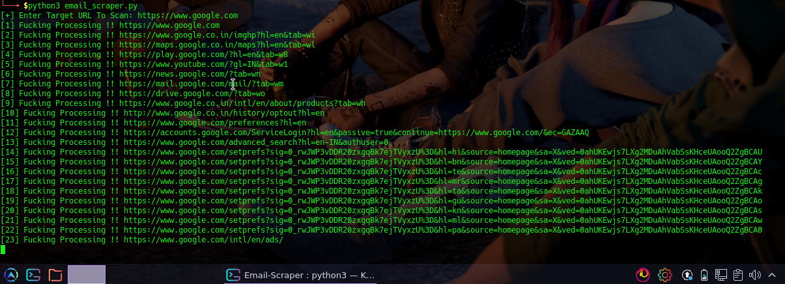

# Email-Scraper
Email harvesting or scraping tool !!

<br>

`Email harvesting or scraping is the process of obtaining lists of email addresses using various methods.`

`Typically these are then used for bulk email or spam`

`The simplest method involves spammers purchasing or trading lists of email addresses from other spammers.`

## Disclaimer
*This tool is for educational purposes only !*<br />

*I will not be responsible for any misuse*⚠️

## Usage
Clone it by
```bash
git clone https://github.com/encryptedn00b/Email-Scraper
```
Go to the Email-Scraper Directory
```bash
cd Email-Scraper
```
Run it
```bash
python3 Email-Scraper.py
```
